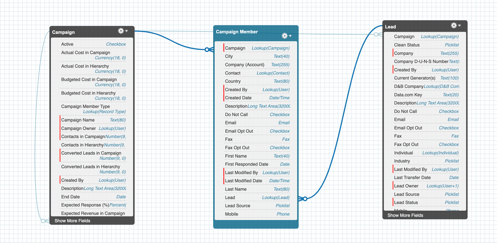

# Salesforce Integration - Assign Leads to Campaign

Salesforce integration exercise using jsforce to assign Leads (Lead) to Campaign (Campaign) via Campaign Member (CampaignMember) table

## Description

Early verison of an integration between a local file system (fs) designed to read the first lead within the local .json file and assigned to a Campaign based on the Lead.ProductInterest__c.

If Lead.ProductInterest__c is equal to any Campaign.Name, then the Lead will be associated to the Campaign record.

The below highlights the relationship between the three Salesforce tables.


### Get Started

- clone [GitHub Repo](https://github.com/andrewcircelli/assign-leads-to-campaign.git)
- use command ```npm init -y ``` to install dependencies
- create env file with below
  - PORT=
  - SF_LOGIN_URL=https://login.salesforce.com
  - SF_USERNAME=
  - SF_PASSWORD=
  - SF_TOKEN=
- update leads.json to valid leads from your Salesforce instance (note only first element in array is being considered in this version)
- ensure you have an active Campaign record with a Name equal to a valid picklist value of Lead.ProductInterest__c
- use command ```npm run start:dev``` to spin up server on localhost if you are further developing OR
- use command ```npm run start``` to spin up server on localhost
- navigate to root of localhost and ```server.js home page logic``` will init
- navigate to ```/api/assign-leads``` of localhost and ```server.js lead assignment logic``` will init

### Primary Modules

- express
- nodemon
- jsforce

### Next Steps to Consider

- Functionality to read across the entire ```leads.json ``` file and not just the first lead record.
- Pull lead information from other sources instead of local file system (e.g. db that is synchronize with Salesforce Org or scheduled API calls).
- Rethink the way the query and CRUD functions of ```assign-leads-campaign``` are configured. I do not like the nested function or using the ```req {}``` to store varibles.
- More helpful error handling responses, e.g., when trying to assign the same Lead to the same Campaign.
- Standard Salesforce automation tools could probably do this.
